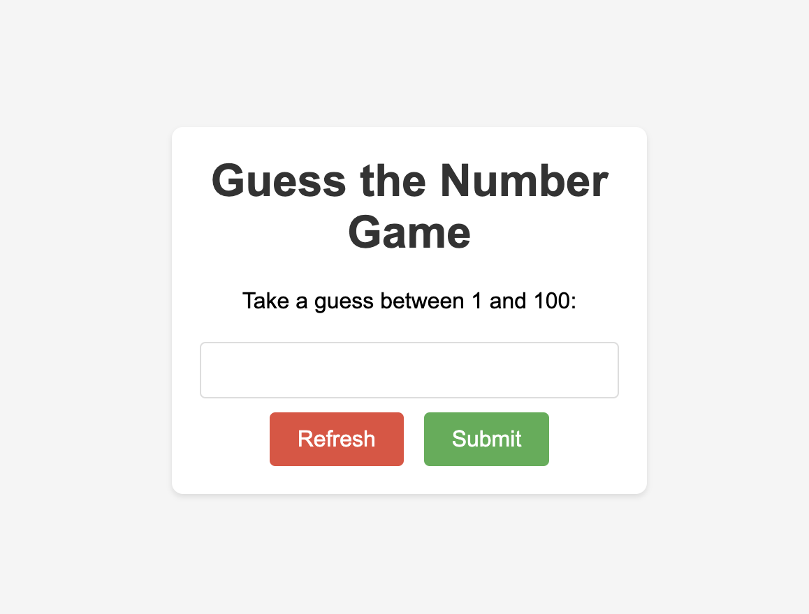

# Guess-the-Number
A simple web-based game where players try to guess a randomly generated number within a specified range. The game provides feedback on each guess, indicating whether the guess is too high or too low. Players can continue guessing until they guess the correct number.

## Features:
- Generates a random number between 1 and 100 for players to guess.
- Provides feedback on each guess, indicating if it's too high or too low.
- Displays a congratulatory message when the correct number is guessed.
- Allows players to refresh the game to generate a new random number.
- Supports keyboard input, allowing players to press Enter to submit their guesses.

## Technologies Used:
- HTML, CSS, JavaScript
- Node.js, Express.js for server-side handling
- Fetch API for handling HTTP requests
- GitHub for version control and hosting

## How to Play:
1. Open the game in a web browser.
2. Enter your guess in the input field.
3. Click the "Submit" button or press Enter to submit your guess.
4. Receive feedback on your guess and continue guessing until you find the correct number.
5. Click the "Refresh" button to generate a new random number and restart the game.

Enjoy the challenge of guessing the correct number in this simple and fun game!
